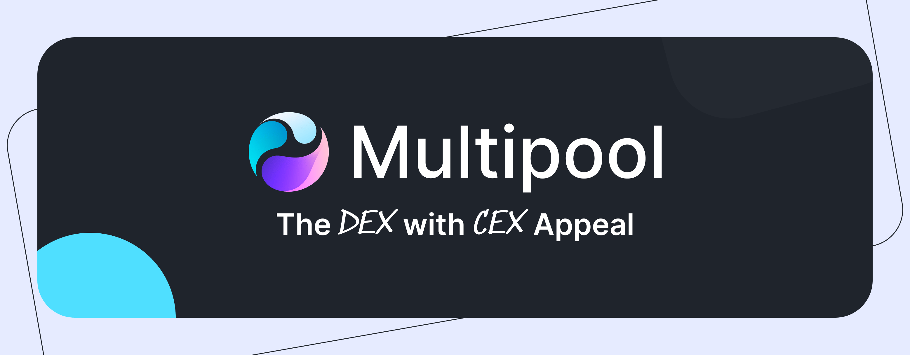
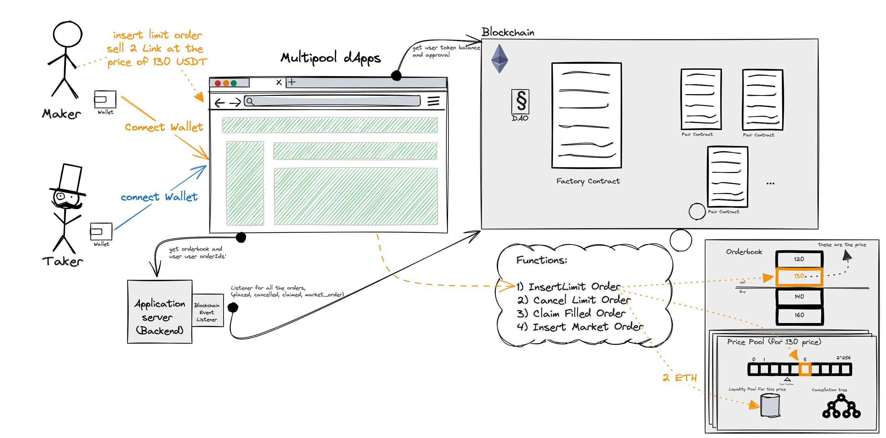

# MultiPool Finance SmartContracts





## Table of Contents
1. [Introduction](#introduction)
2. [Contracts](#contracts)
3. [Usage](#usage)
4. [Contributing](#contributing)
5. [Audit Report](#audit-report)
5. [License](#license)


## Introduction
<a name="introduction"></a>

This repository hosts the core smart contracts for the Multipool Finance platform, a pioneering on-chain order book decentralized exchange (DEX) featuring innovative on-chain matching functionality. At Multipool, we leverage advanced data structures like segment trees to optimize gas costs, significantly enhancing transaction efficiency and on-chain user experience and also we support multiple order type.

Our unique approach redefines the traditional maker-taker flow, adapting it to better suit on-chain environments. For a detailed explanation of our platform's mechanics, including our novel approach to handling gas costs and order matching, please refer to our [whitepaper](https://whitepaper.multipool.finance/).




## Contracts
<a name="contracts"></a>

The core functionality of the Multipool Finance platform is encapsulated within three main contracts:


1. `src/PairFactory.sol`: This contract is responsible for deploying new pairs and managing variables such as fees and the ability to pause pairs. It acts as a factory for creating new trading pairs on the platform.

2. `src/PairContract.sol`: This contract implements the `pricePool` and `cancelationTree`, and manages the order book for a specific pair. It is responsible for maintaining the state of each trading pair, including current orders and prices.

3. `segmentTree.sol` (located in `src/lib`): This is a library contract that provides functionality for working with segment trees, a data structure that is used to managing cancellations tree for each `pricePool` and help us to design gas efficient on-chain Dex.


you can find detailed technical documentation for each contract in the `doc` folder.


## Usage
<a name="usage"></a>

This project uses a Makefile for managing tasks. Here are the available commands:

```
- `make anvil`: This command will ask you if you want to fork a chain. If you choose "yes", you will be prompted to enter the RPC URL and Block Number. Then it will run the local network in fork mode. If you choose "no", it will run a simple local network.

- `make test`: This command runs smart contract tests with Foundry.

- `make deploy`: This command will ask you to enter the contract filename and contract name (e.g., MyContract.sol:MyContract). Then it will ask if you want to deploy on localhost. If you choose "yes", make sure you have a local network running on port 8545 (you can run 'make anvil' in a separate terminal for this). If you choose "no", you will be prompted to enter the RPC URL, Chain ID, your etherscan API key (for verifying contract), the path to the constructor arguments file (e.g., ./args), and your private key. The deployment details will be appended to a file named `deploy_history.txt`.

- `make install`: This command installs the slither for the security analysis and also the foundry dependencies.

- `make slither`: This command runs Slither, a Solidity static analysis framework.

- `make format`: This command formats the code style.

- `make clean`: This command cleans up the build and out directory.

- `make snapshot`: This command creates a snapshot of gas usage.

- `make interact`: This command provides instructions on how to interact with your deployed contract.
```


If you are using VSCode, refer to the following link for guidance on handling Foundry remapping:

> https://github.com/foundry-rs/foundry/issues/2019#issuecomment-1191392804\

### Rivet
<a name="Rivet"></a>

[Rivet](https://github.com/paradigmxyz/rivet/tree/main) is a tool for Ethereum developers that provides a set of utilities for smart contract development and testing. It includes features for contract deployment, interaction, and inspection. You can use Rivet to interact with your deployed contracts instead of the approach described in the `make interact` command.

## Contributing
<a name="contributing"></a>

there is multiple way to contribute to this project:
1. **Bug Reports**: 

    If you encounter a bug, please open an issue describing the bug and how to reproduce it.
2. **Feature Requests**: 

    If you have an idea for a new feature, please open an issue describing the feature and how it should work.
3. **Pull Requests**: 

    If you would like to contribute to the project, please open a pull request with your changes. Please make sure to follow the guidelines below when creating a pull request.
4. **Join the Team**: 
        
    If you are interested in joining the team, please reach out to us.

### Pull Request Guidelines
1. **Branching and Commit Message Standards**

    Branch Naming: Create a new branch for each feature, bug fix, or optimization. The branch name should follow the format `[type]/[name]`, where `[type]` can be `feat`, `bugfix`, or `optimization`, and `[name]` is a brief description of the change. For example, for a feature named "Limit Order", the branch would be `feat/limit-order`.

2. **Commit Messages:**

     Commit messages should be descriptive and follow the format `[Type]`: `[Brief Description]`. The `[Type]` can be `feat`, `fix`, `docs`, `style`, `refactor`, `perf`, `test`, or `chore`.

### Pull Request Flow
* **New Branches:** 
    
    Developers create new branches for each specific change and create a PR for that branch.
* **Development Branch:** 

    PRs from new branches are merged into the development branch. All test cases must pass, and the code coverage must be at least 60%.
* **Master Branch:** 

    After thorough testing and review, changes from the development branch are merged into the master branch.


## Audit Report
<a name="audits"></a>
Check audit [directory](./audits/audit.md) for audit report. 

## License
<a name="license"></a>
TBD