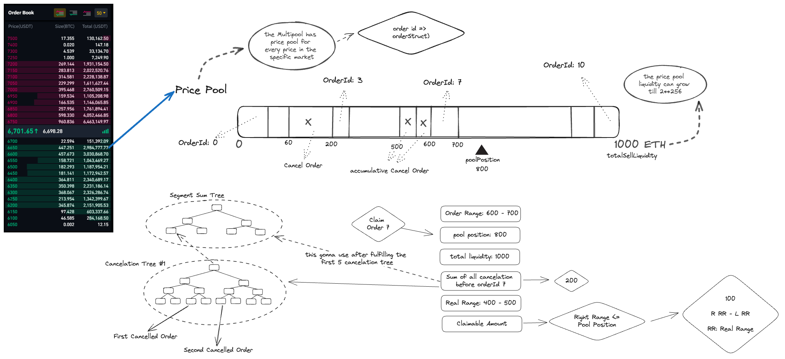

# MultiPool Finance SmartContracts

## Table of Contents
1. [Introduction](#introduction)
2. [Contracts](#introduction)
3. [Usage](#usage)
4. [Contributing](#contributing)
5. [License](#license)

## Introduction

This repository hosts the core smart contracts for the Multipool Finance platform, a pioneering on-chain order book decentralized exchange (DEX) featuring innovative on-chain matching functionality. At Multipool, we leverage advanced data structures like segment trees to optimize gas costs, significantly enhancing transaction efficiency and on-chain user experience.

Our unique approach redefines the traditional maker-taker flow, adapting it to better suit on-chain environments. For a detailed explanation of our platform's mechanics, including our novel approach to handling gas costs and order matching, please refer to our [whitepaper](https://whitepaper.multipool.finance/).

## Contracts

The core functionality of the Multipool Finance platform is encapsulated within three main contracts:

1. `src/PairFactory.sol`: This contract is responsible for deploying new pairs and managing variables such as fees and the ability to pause pairs. It acts as a factory for creating new trading pairs on the platform.

2. `src/PairContract.sol`: This contract implements the `pricePool` and `cancelationTree`, and manages the order book for a specific pair. It is responsible for maintaining the state of each trading pair, including current orders and prices.

3. `segmentTree.sol` (located in `src/lib`): This is a library contract that provides functionality for working with segment trees, a data structure that is used to managing cancellations tree for each `pricePool` and help us to design gas efficient on-chain Dex.

you can find detailed technical documentation for each contract in the `doc` folder.

## Usage

## Contributing

## License
